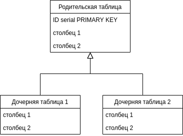
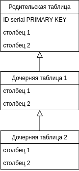

## Лабораторная работа №11

Наследование в PosgreSQL

## Цель работы

Изучить механизм наследования таблиц в PostgreSQL.

## Ход работы

PostgreSQL реализует наследование  таблиц, что может быть полезно для проектировщиков баз данных. 

Давайте начнём со следующего примера: предположим, что мы создаём модель данных для городов. В каждой стране есть множество городов, но лишь одна  столица. Мы хотим иметь возможность быстро получать город-столицу для  любой страны. Это можно сделать, создав две таблицы: одну для столиц  стран, а другую для городов, не являющихся столицами. Однако что  делать, если нам нужно получить информацию о любом городе, будь то  столица штата или нет? В решении этой проблемы может помочь  наследование. Мы определим таблицу `capitals` как наследника `cities`: 


**Schema (PostgreSQL v13)**

```sql
CREATE TABLE cities (
    name            text,
    population      float
);

CREATE TABLE capitals (
    state           char(2)
) INHERITS (cities);

INSERT INTO cities(name, population)
VALUES 
('Vladimir', 0.35),
('Orenburg', 0.57),
('Murom', 0.1),
('Ivanovo', 0.4),
('Yaroslavl', 0.637);

INSERT INTO capitals(name, population, state)
VALUES 
('Moscow', 14.2, 'RU'),
('Rome', 3.9, 'IT'),
('Berlin', 3.6, 'DE'),
('Kiev', 2.9, 'UA'),
('Minsk', 2.0, 'BY');
```

---

**Выборка всех городов (в том числе столиц)**

Как мы видим выборка из родительской таблицы `cities` покажет записи из из всех её дочерних таблиц `capitals`

```sql
SELECT * FROM cities;
```

| name      | population |
| --------- | ---------- |
| Vladimir  | 0.35       |
| Orenburg  | 0.57       |
| Murom     | 0.1        |
| Ivanovo   | 0.4        |
| Yaroslavl | 0.637      |
| Moscow    | 14.2       |
| Rome      | 3.9        |
| Berlin    | 3.6        |
| Kiev      | 2.9        |
| Minsk     | 2          |

---
**Выборка только из родительской таблицы**

Если мы хотит получить записи <u>только</u> из таблицы `cities` и только из неё используем английское слово `только` -- **ONLY** перед названием таблицы.

```sql
SELECT * FROM ONLY cities;
```

| name      | population |
| --------- | ---------- |
| Vladimir  | 0.35       |
| Orenburg  | 0.57       |
| Murom     | 0.1        |
| Ivanovo   | 0.4        |
| Yaroslavl | 0.637      |

---
**Название таблицы**

```sql
SELECT c.tableoid::regclass, c.name, c.population
FROM cities c;
```

| tableoid | name      | population |
| -------- | --------- | ---------- |
| cities   | Vladimir  | 0.35       |
| cities   | Orenburg  | 0.57       |
| cities   | Murom     | 0.1        |
| cities   | Ivanovo   | 0.4        |
| cities   | Yaroslavl | 0.637      |
| capitals | Moscow    | 14.2       |
| capitals | Rome      | 3.9        |
| capitals | Berlin    | 3.6        |
| capitals | Kiev      | 2.9        |
| capitals | Minsk     | 2          |

---
**Использование названия таблицы в запросе**

```sql
SELECT
	CASE 
    	WHEN c.tableoid::regclass::text = 'cities' THEN false
    	WHEN c.tableoid::regclass::text = 'capitals' THEN true
        ELSE false
    END AS is_capital,
    c.name,
    c.population
FROM cities c;
```

| is_capital | name      | population |
| ---------- | --------- | ---------- |
| false      | Vladimir  | 0.35       |
| false      | Orenburg  | 0.57       |
| false      | Murom     | 0.1        |
| false      | Ivanovo   | 0.4        |
| false      | Yaroslavl | 0.637      |
| true       | Moscow    | 14.2       |
| true       | Rome      | 3.9        |
| true       | Berlin    | 3.6        |
| true       | Kiev      | 2.9        |
| true       | Minsk     | 2          |

---

[View on DB Fiddle](https://www.db-fiddle.com/f/84Yvjhb4DPxhzVpHxt5hVy/1)


## Задание 

Выполнять тут:

https://www.db-fiddle.com/ или  http://sqlfiddle.com/ или на вашей локальной машине, но все коды работ загрузить на соответствующий сервис.


### Вариант 1

Создать три таблицы (или по желанию больше) на тему **Автосалон**. При это обязательно должно быть использовано наследование таблиц. У каждой таблицы должно быть минимум два столбца (за исключением первичного ключа ID) и три осмысленных записи. У вас должна быть одна родительская таблица и две дочерние, со структой, как показано на картинке ниже:

  

### Вариант 2

Создать три таблицы (или по желанию больше) на тему **Колледж**. При это обязательно должно быть использовано наследование таблиц. У каждой таблицы должно быть минимум два столбца (за исключением первичного ключа ID) и три осмысленных записи. У вас должна быть одна родительская таблица и две дочерние, со структой, как показано на картинке ниже:

  

### Вариант 3

Создать три таблицы (или по желанию больше) на тему **Склад продуктов**. При это обязательно должно быть использовано наследование таблиц. У каждой таблицы должно быть минимум два столбца (за исключением первичного ключа ID) и три осмысленных записи. У вас должна быть одна родительская таблица и две дочерние, со структой, как показано на картинке ниже:

  


### Вариант 4

Создать три таблицы (или по желанию больше) на тему **Библиотека**. При это обязательно должно быть использовано наследование таблиц. У каждой таблицы должно быть минимум два столбца (за исключением первичного ключа ID) и три осмысленных записи. У вас должна быть одна родительская таблица и две дочерние, со структой, как показано на картинке ниже:

  


### Вариант 5

Создать три таблицы (или по желанию больше) на тему **Поликлиника**. При это обязательно должно быть использовано наследование таблиц. У каждой таблицы должно быть минимум два столбца (за исключением первичного ключа ID) и три осмысленных записи. У вас должна быть одна родительская таблица и две дочерние, со структой, как показано на картинке ниже:

  

## Требования к отчёту

1. Титульная страница 

   Титульная страница должна содержать:

   1. Наименование учебного учреждения
   2. Наименование предмета
   3. Фамилию и инициалы студента
   4. Фамилию и инициалы преподавателя принимающего работу
   5. **Номер индивидуального задания** (если имеется)

2. Цель работы

3. Выполнение задания

4. **Ссылка на работу** https://www.db-fiddle.com или http://sqlfiddle.com/ ссылка должна быть выделена **жирным текстом** и в тексте присутствовать полностью. Несмотря на предоставление ссылки на работу все коды программы должны полностью присутствовать в отчёте.

5. Выводы по работе